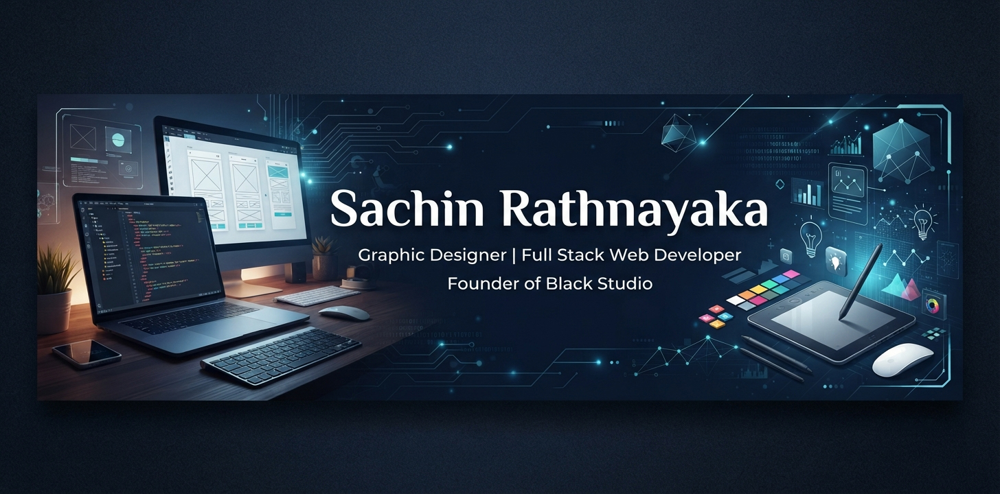

<!-- ═══════════════════════════════════════════════════════════════ -->

<!--                     GITHUB PROFILE README                       -->

<!-- ═══════════════════════════════════════════════════════════════ -->

<p align="center">
  
</p>

<p align="center">
  
  
</p>

<h1 align="center">Hi 👋, I'm Sachin Rathnayaka</h1>

<h3 align="center">
  Graphic Designer • Full Stack Web Developer • UI/UX Designer
</h3>

<p align="center">
  
</p>

<p align="center">
  <a href="https://github.com/sirathnayaka">
    
  </a>
  <a href="https://sirathnayaka.github.io/premium-portfolio/">
    
  </a>
  <a href="mailto:imantha0316@gmail.com">
    
  </a>
</p>

---

## 👨‍💻 About Me

I'm a passionate **Graphic Designer and Full Stack Web Developer from Sri Lanka**, focused on creating modern digital experiences through design, development, and technology.

I enjoy transforming ideas into **beautiful interfaces, responsive websites, functional web applications, and creative digital solutions**.

* 🎓 **HNDIT – Information Technology Student**
* 💻 **Full Stack Web Developer**
* 🎨 **Professional Graphic Designer**
* 🖥️ **UI/UX Designer**
* 🚀 Interested in **Software Development & Digital Products**
* 🌱 Currently improving my **Full Stack Development** skills
* 🏢 Founder of **Black Studio**
* 🇱🇰 Based in **Sri Lanka**
* 📫 **Email:** [imantha0316@gmail.com](mailto:imantha0316@gmail.com)

---

## 🚀 What I Do

<table>
<tr>
<td width="50%">

### 💻 Web Development

* Responsive Website Development
* Full Stack Web Applications
* PHP & MySQL Development
* Database Design
* REST API Integration
* Admin Dashboard Development
* Authentication & Authorization
* CRUD Systems

</td>

<td width="50%">

### 🎨 Creative & Design

* UI/UX Design
* Website Design
* Graphic Design
* Branding
* Social Media Design
* Logo Design
* Promotional Design
* Design Systems

</td>
</tr>
</table>

---

# 🛠️ Tech Stack

### 🌐 Frontend

<p>
  
</p>

### ⚙️ Backend & Database

<p>
  
</p>

### 💻 Programming

<p>
  
</p>

### 🎨 Design

<p>
  
</p>

### 🔧 Tools & Platforms

<p>
  
</p>

---

# 🎨 Design Expertise

<p>
  
  
  
  
  
</p>

---

# 💼 Featured Projects

### 🏭 Garment Inventory Management System

A complete inventory management solution designed for garment businesses.

**Technologies:**
`HTML` `CSS` `JavaScript` `PHP` `MySQL`

**Modules include:**

* 📊 Dashboard
* 📦 Product Management
* 🏷️ Categories
* 📋 Inventory Management
* 🏢 Warehouses
* 🚚 Suppliers
* 🛒 Purchases
* 🏭 Production
* ✅ Quality Control
* 📑 Sales Orders
* 👥 Customers
* 👨‍💼 Employees
* ⏱️ Attendance
* 🔳 Barcode / QR
* 📈 Reports
* 🔔 Notifications
* 🔐 Users & Roles
* ⚙️ Settings

---

### 💼 Online Job Portal

A web-based platform designed to connect job seekers and employers.

**Technologies:**
`PHP` `MySQL` `HTML` `CSS` `JavaScript` `Bootstrap`

**Features:**

* 🔎 Job Search
* 👤 User Authentication
* 🏢 Employer Profiles
* 📄 Job Applications
* 📍 Job Regions
* 📝 Job Management
* 🔐 Role-Based Access
* 📊 Admin Management

---

### ⚡ Electricity Billing System

A web-based electricity billing and customer management system.

**Technologies:**
`HTML` `CSS` `JavaScript` `PHP` `MySQL`

**Features:**

* 👤 Customer Management
* ⚡ Meter Management
* 🧾 Bill Generation
* 💳 Payment Management
* 📊 Billing Records
* 🔐 Authentication

---

### 💊 Pharmacy Inventory Management System

Inventory and sales management solution designed for pharmacy operations.

**Technologies:**
`PHP` `MySQL` `HTML` `CSS` `JavaScript`

**Features:**

* 📦 Stock Management
* 💊 Product Management
* 🏷️ Categories
* 🚚 Suppliers
* 🧾 Sales & Invoices
* 📊 Reports
* 👥 Customer Management
* 🔐 User Roles

---

# 📊 GitHub Statistics

<p align="center">
  
  
</p>

---

# 📈 Contribution Activity

<p align="center">
  
</p>

---

# 🐍 GitHub Contribution Snake

<p align="center">
  
</p>

---

# 🎯 Current Goals

```text
✓ Improve Full Stack Development
✓ Build Production-Ready Web Applications
✓ Improve UI/UX Design Skills
✓ Learn Modern Web Technologies
✓ Build Real-World Software Solutions
✓ Grow Black Studio
✓ Contribute to Open Source
```

---

# 🌐 Connect With Me

<p align="center">

<a href="https://github.com/sirathnayaka">

</a>

<a href="https://sirathnayaka.github.io/premium-portfolio/">

</a>

<a href="mailto:imantha0316@gmail.com">

</a>

</p>

---

<h3 align="center">
  💡 "Design with purpose. Build with passion."
</h3>

<p align="center">
  <b>Thanks for visiting my profile! 🚀</b>
</p>

<p align="center">
  ⭐ Feel free to explore my repositories and projects.
</p>
